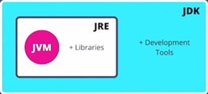
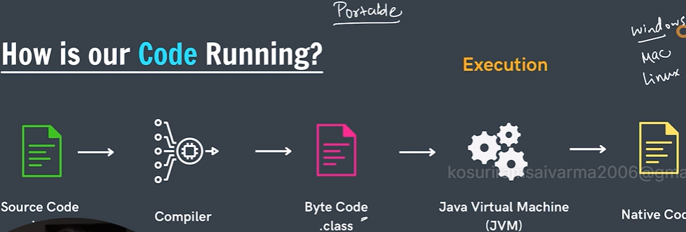

# How Java Code Runs

Java code does not run directly.

It goes through different steps before giving output.

## Step-by-Step Process

```text
Source Code → Compiler → Byte Code → JVM → Native Code → Output
```

---

## 1. Source Code

This is the code written by the programmer.

Example:

```java
public class JavaBasics {
    public static void main(String[] args) {
        System.out.println("Hello Java");
    }
}
```

This file is saved as:

```text
JavaBasics.java
```

---

## 2. Compiler

Java compiler converts source code into:

```text
Byte Code
```

Command:

```text
javac JavaBasics.java
```

After compilation:

```text
JavaBasics.class
```

file is created.

---

## 3. Byte Code

Byte code is an intermediate code.

It is not machine code.

Extension:

```text
.class
```

This makes Java:

```text
Platform Independent
```

because bytecode can run on any system.

Example:

```text
Windows
Mac
Linux
```

---

## 4. JVM (Java Virtual Machine)

JVM converts bytecode into:

```text
Machine Code / Native Code
```

Then program executes.

Command:

```text
java JavaBasics
```

---

## Flow of Java Execution

```text
Java Code (.java)
        ↓
Compiler (javac)
        ↓
Byte Code (.class)
        ↓
JVM
        ↓
Machine Code
        ↓
Output
```

---

## JDK, JRE and JVM

### JVM

JVM stands for:

```text
Java Virtual Machine
```

It runs Java bytecode.

---

### JRE

JRE stands for:

```text
Java Runtime Environment
```

JRE contains:

```text
JVM + Libraries
```

Used to run Java programs.

---

### JDK

JDK stands for:

```text
Java Development Kit
```

JDK contains:

```text
JRE + Development Tools
```

Used to develop Java programs.

Example tools:

```text
Compiler (javac)
Debugger
```

---

## Important Note

Java is called:

```text
Write Once, Run Anywhere (WORA)
```

because Java bytecode can run on any operating system using JVM.

## Diagram Explanation

### Java Code Execution Flow



### JDK, JRE and JVM Relationship


