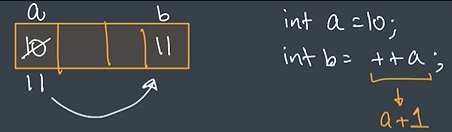
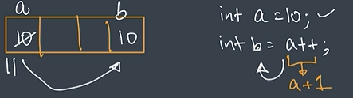

# Unary Operators

Unary operators work on only **one operand**.

Example:

```java
a++
```

Here only one operand is used:

```text
a
```

## Types of Unary Operators

```text
++
--
```

- `++` → Increment Operator
- `--` → Decrement Operator

---

# Increment Operator `++`

Increment operator increases value by:

```text
+1
```

Example:

```java
int a = 10;
a++;

System.out.println(a);
```

## Output

```text
11
```

---

# Decrement Operator `--`

Decrement operator decreases value by:

```text
-1
```

Example:

```java
int a = 10;
a--;

System.out.println(a);
```

## Output

```text
9
```

---

# Types of Increment Operators

There are two types:

```text
1. Pre Increment (++a)
2. Post Increment (a++)
```

---

## 1. Pre Increment `++a`

### Rule

```text
1. Value changes
2. Value gets used
```

Example:

```java
public class JavaBasics {
    public static void main(String[] args) {

        int a = 10;
        int b = ++a;

        System.out.println(a);
        System.out.println(b);

    }
}
```

## Understanding

First value changes:

```text
10 → 11
```

Then it gets assigned.

So:

```text
a = 11
b = 11
```

## Output

```text
11
11
```

### Diagram



---

## 2. Post Increment `a++`

### Rule

```text
1. Value gets used
2. Value changes
```

Example:

```java
public class JavaBasics {
    public static void main(String[] args) {

        int a = 10;
        int b = a++;

        System.out.println(a);
        System.out.println(b);

    }
}
```

## Understanding

First value is used:

```text
b = 10
```

Then value changes:

```text
a = 11
```

## Output

```text
11
10
```

### Diagram



---

# Decrement Types

Same concept applies to decrement:

```text
--a  → Pre Decrement
a--  → Post Decrement
```

## Important Shortcut

### Pre

```text
Change → Use
```

### Post

```text
Use → Change
```
