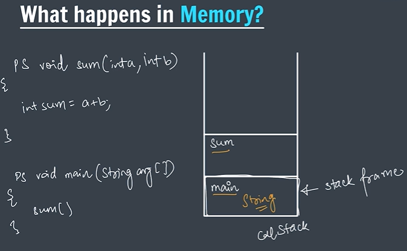
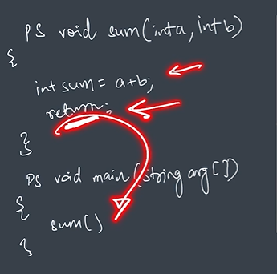
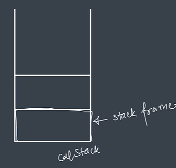

# What Happens in Memory? (Call Stack)

Whenever functions execute in Java:

```text
memory is used
```

to store information about those functions.

Java manages this using:

```text
Call Stack
```

---

## What is Stack?

A:

```text
stack
```

means:

```text
one thing placed over another
```

Example:

```text
Stack of plates
Stack of books
```

The item added:

```text
last
```

comes out:

```text
first
```

This is called:

```text
LIFO
(Last In First Out)
```

---

## What is Call Stack?

The:

```text
Call Stack
```

stores information about:

```text
function calls
```

Whenever a function executes:

```text
a stack frame
```

(memory block)

gets created inside:

```text
call stack
```

---

## What is Stack Frame?

A:

```text
stack frame
```

is a memory block that stores:

- Function information
- Variables
- Parameters
- Return information

Every function gets:

```text
its own stack frame
```

---

## Example Program

```java
public class JavaBasics {

    public static void sum(int a, int b) {

        int sum = a + b;

        return;
    }

    public static void main(String[] args) {

        sum(5, 10);

    }
}
```

---

## Understanding Flow of Execution

When program starts:

Java first executes:

```java
main()
```

So:

```text
main function stack frame
```

is created inside memory.

---

### Step 1

Program starts.

Call stack becomes:

```text
┌─────────────┐
│    main     │
└─────────────┘
```

---

### Step 2

Inside:

```java
main()
```

we call:

```java
sum(5,10)
```

Now Java creates another:

```text
stack frame
```

for:

```text
sum()
```

Call stack becomes:

```text
┌─────────────┐
│    sum      │
├─────────────┤
│    main     │
└─────────────┘
```

---

### Step 3

Inside:

```java
sum()
```

Java calculates:

```java
int sum = a + b;
```

After function completes:

```java
return;
```

executes.

---

### Step 4

Now:

```text
sum() stack frame
```

gets removed from memory.

Call stack becomes:

```text
┌─────────────┐
│    main     │
└─────────────┘
```

---

### Step 5

After:

```java
main()
```

completes execution,

its stack frame also gets:

```text
removed
```

Call stack becomes:

```text
empty
```

---

## Flow Diagram

```text
Program Starts
        ↓
main() enters memory
        ↓
sum() called
        ↓
sum() stack frame added
        ↓
sum() completes
        ↓
sum() removed
        ↓
main() completes
        ↓
memory cleared
```

---

## Screenshot Understanding

### Call Stack Working

Add image here:



Explanation:

First:

```text
main()
```

enters memory.

Then:

```text
sum()
```

gets added above it.

This happens because:

```text
new function calls are added on top
```

---

### Return Statement Understanding

Add image here:



When:

```java
return;
```

executes,

the function:

```text
goes back
```

to where it was called.

Its memory also gets:

```text
removed from stack
```

---

### Stack Frame Understanding

Add image here:



Each function gets its own:

```text
stack frame
```

inside:

```text
call stack
```

---

## Your Notes

```text
// what happens in memory?(call stack)

// stack means ek ke ek aur chez rakna
// like stack of plates or stack of books

// here the call stack stores the information
// about that function

// firstly it stores info of main function

// then adds another stack
// with sum function information

// whenever we return from sum function
// then sum memory gets empty

// when main function completes
// call stack also gets cleared
```

---

## Important Note

```text
Function Call → Stack Frame Added

Function Ends → Stack Frame Removed
```

Java follows:

```text
LIFO
(Last In First Out)
```

for:

```text
Call Stack
```
