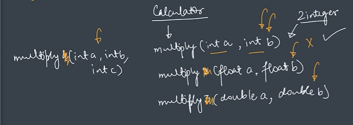

# Function Overloading

Function Overloading is a feature in Java that allows multiple methods to have the same name but different parameters.

Java identifies the correct method based on:

- Number of Parameters
- Type of Parameters

This helps us perform similar operations using the same method name.

---

## Why Learn Function Overloading?

Function Overloading helps us:

- Improve code readability
- Reuse method names
- Reduce confusion
- Make programs easier to understand

---

## Definition

Function Overloading means:

```text
Multiple functions with the same name
but different parameters.
```

From my notes:

```text
FUNCTION OVERLOADING

Multiple functions with the same name but different parameters.

Here we check based on:

- Type of Parameters
- Number of Parameters
```

---

## Notes Screenshot

### Function Overloading Concept



### Types of Function Overloading


---

## How Java Identifies Overloaded Methods?

Java does NOT identify overloaded methods using:

```text
Return Type
```

Java identifies overloaded methods using:

```text
1. Number of Parameters
2. Type of Parameters
```

From my notes:

```text
- type of params
- no of params
```

---

## Overloading Using Number of Parameters

Example:

```java
multiply(int a, int b)

multiply(int a, int b, int c)
```

Here:

```text
Method Name = Same
Number of Parameters = Different
```

Therefore Java treats them as different methods.

---

## Overloading Using Data Types

Example:

```java
multiply(int a, int b)

multiply(float a, float b)

multiply(double a, double b)
```

Here:

```text
Method Name = Same
Data Types = Different
```

Therefore Java treats them as different methods.

---

## Visual Representation

```text
Calculator

multiply(int a, int b)

multiply(float a, float b)

multiply(double a, double b)
```

Java automatically chooses the correct method based on the arguments passed.

---

## Real Life Example

Think of a Calculator.

When multiplying:

```text
2 × 3
```

Java can use:

```java
multiply(int, int)
```

When multiplying:

```text
2.5 × 3.5
```

Java can use:

```java
multiply(float, float)
```

When multiplying:

```text
2.55 × 3.55
```

Java can use:

```java
multiply(double, double)
```

Same operation.

Different parameter types.

This is Function Overloading.

---

## Comparison Table

| Method Name | Parameters | Valid Overloading |
|------------|------------|-------------------|
| multiply() | int, int | ✅ |
| multiply() | int, int, int | ✅ |
| multiply() | float, float | ✅ |
| multiply() | double, double | ✅ |

---

## Key Learning

- Multiple methods can have the same name.
- Methods must differ by parameters.
- Difference can be in number of parameters.
- Difference can be in parameter data types.
- Java chooses the correct method automatically.
- Function Overloading improves readability and code reusability.

---

## Special Note

From my notes:

```text
Function Overloading

Multiple functions with the same name but different parameters.

Based on:

- Type of Parameters
- Number of Parameters
```

Function Overloading does not depend on the return type.

Only changing the return type is not considered Function Overloading in Java.
