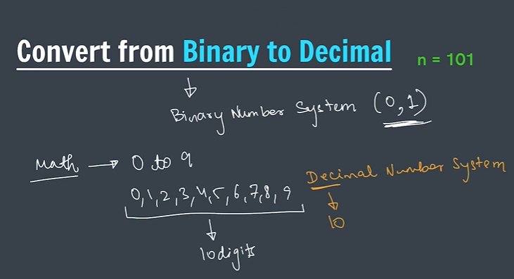
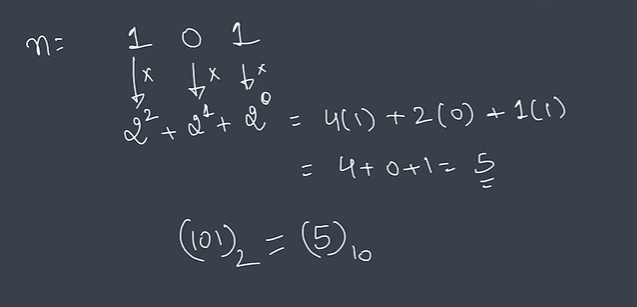
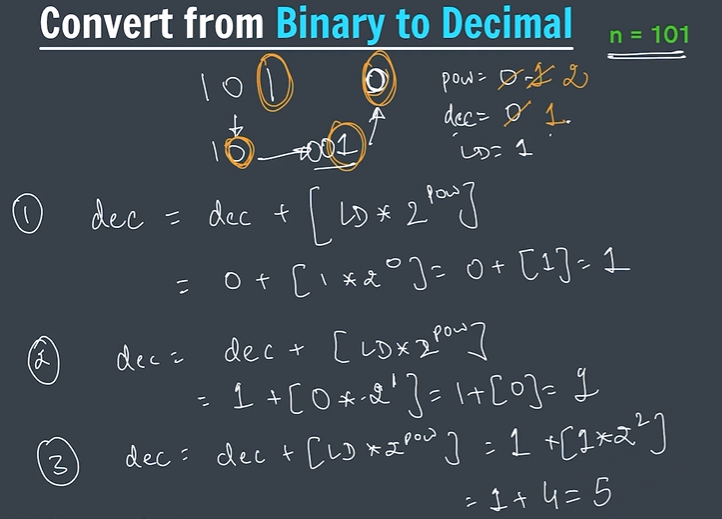

# Binary to Decimal

Before writing the code, it is important to understand how Binary Numbers are converted into Decimal Numbers.

---

## What is a Binary Number System?

Binary Number System uses only:

```text
0 and 1
```

Example:

```text
101
1101
10011
```

Binary numbers are represented using:

```text
Base 2
```

because only two digits are available:

```text
0, 1
```

---

## What is a Decimal Number System?

Decimal Number System uses:

```text
0, 1, 2, 3, 4, 5, 6, 7, 8, 9
```

It contains:

```text
10 digits
```

and is represented using:

```text
Base 10
```

---

## Notes Screenshot

### Binary vs Decimal Number System



---

## Mathematical Conversion

Suppose:

```text
n = 101₂
```

Each digit is multiplied by the power of 2.

```text
1 × 2² + 0 × 2¹ + 1 × 2⁰
```

Calculation:

```text
= 4 + 0 + 1

= 5
```

Therefore:

```text
(101)₂ = (5)₁₀
```

---

## Notes Screenshot

### Mathematical Conversion



---

## Formula

```text
Decimal Number

= digit × 2^position
```

where:

```text
Position starts from 0
and increases from right to left
```

Example:

```text
101
```

| Digit | Position | Calculation |
|---------|---------|-------------|
| 1 | 2 | 1 × 2² = 4 |
| 0 | 1 | 0 × 2¹ = 0 |
| 1 | 0 | 1 × 2⁰ = 1 |

Total:

```text
4 + 0 + 1 = 5
```

---

## How Code Logic Works

In code we process digits from:

```text
Right to Left
```

For:

```text
101
```

Initially:

```text
pow = 0
dec = 0
```

Step 1:

```text
Last Digit = 1

dec = dec + (1 × 2⁰)

dec = 0 + 1

dec = 1
```

---

Step 2:

```text
Last Digit = 0

dec = 1 + (0 × 2¹)

dec = 1
```

---

Step 3:

```text
Last Digit = 1

dec = 1 + (1 × 2²)

dec = 1 + 4

dec = 5
```

Final Answer:

```text
5
```

---

## Notes Screenshot

### Logic Used in Code



---

## Dry Run Table

Input:

```text
101
```

| Step | Last Digit | Power | Calculation | Decimal |
|--------|-----------|--------|-------------|---------|
| 1 | 1 | 0 | 1 × 2⁰ = 1 | 1 |
| 2 | 0 | 1 | 0 × 2¹ = 0 | 1 |
| 3 | 1 | 2 | 1 × 2² = 4 | 5 |

Final Output:

```text
5
```

---

## Visual Representation

```text
Binary Number

101

      1 × 2² = 4
      0 × 2¹ = 0
      1 × 2⁰ = 1

      ↓

4 + 0 + 1

      ↓

5
```

---

## Key Learning

- Binary numbers use only 0 and 1.
- Binary Number System is Base 2.
- Decimal Number System is Base 10.
- Each binary digit is multiplied by a power of 2.
- Position counting starts from 0.
- The same logic is used later while writing the program.

---

## Special Note

From my notes:

```text
Binary Number System → (0,1)

Decimal Number System → (0 to 9)

101₂

= 1×2² + 0×2¹ + 1×2⁰

= 4 + 0 + 1

= 5
```

This mathematical approach is the foundation of the Binary to Decimal conversion program.
