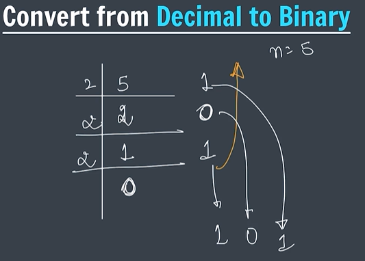
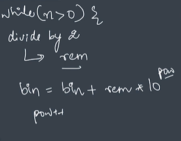

# Decimal to Binary

Before writing the program, it is important to understand how a Decimal Number is converted into a Binary Number.

---

## What is a Decimal Number System?

Decimal Number System uses:

```text
0, 1, 2, 3, 4, 5, 6, 7, 8, 9
```

It contains:

```text
10 digits
```

and is represented using:

```text
Base 10
```

---

## What is a Binary Number System?

Binary Number System uses:

```text
0 and 1
```

and is represented using:

```text
Base 2
```

---

## Notes Screenshot

### Decimal to Binary Conversion



---

## Mathematical Conversion

Suppose:

```text
n = 5
```

Repeatedly divide by 2 and store the remainders.

| Division | Quotient | Remainder |
|-----------|----------|-----------|
| 5 ÷ 2 | 2 | 1 |
| 2 ÷ 2 | 1 | 0 |
| 1 ÷ 2 | 0 | 1 |

Now read the remainders:

```text
Bottom to Top
```

```text
101
```

Therefore:

```text
(5)₁₀ = (101)₂
```

---

## Why Read Bottom to Top?

During division:

```text
5 → 2 → 1 → 0
```

Remainders obtained:

```text
1
0
1
```

Binary digits are formed from the last remainder to the first remainder.

Therefore:

```text
101
```

---

## Visual Representation

```text
5 ÷ 2 = 2 remainder 1

2 ÷ 2 = 1 remainder 0

1 ÷ 2 = 0 remainder 1


Read Bottom to Top

1 0 1
```

---

## Logic Used in Code

In the program:

```text
While n > 0

1. Divide by 2
2. Store remainder
3. Add remainder × 10^power
4. Increase power
5. Continue
```

---

## Notes Screenshot

### Logic Used in Program



---

## Dry Run

Input:

```text
n = 5
```

Initially:

```text
bin = 0

pow = 0
```

### Iteration 1

```text
remainder = 5 % 2

remainder = 1
```

```text
bin = 0 + (1 × 10⁰)

bin = 1
```

---

### Iteration 2

```text
n = 2

remainder = 0
```

```text
bin = 1 + (0 × 10¹)

bin = 1
```

---

### Iteration 3

```text
n = 1

remainder = 1
```

```text
bin = 1 + (1 × 10²)

bin = 101
```

Final Answer:

```text
101
```

---

## Dry Run Table

| Iteration | n | Remainder | Power | Calculation | Binary |
|------------|---|-----------|--------|-------------|--------|
| 1 | 5 | 1 | 0 | 1 × 10⁰ | 1 |
| 2 | 2 | 0 | 1 | 0 × 10¹ | 1 |
| 3 | 1 | 1 | 2 | 1 × 10² | 101 |

Final Output:

```text
101
```

---

## Conversion Summary

```text
Decimal = 5

5 ÷ 2 → remainder 1

2 ÷ 2 → remainder 0

1 ÷ 2 → remainder 1

Read Bottom to Top

101
```

Therefore:

```text
(5)₁₀ = (101)₂
```

---

## Key Learning

- Decimal numbers use Base 10.
- Binary numbers use Base 2.
- Decimal to Binary conversion uses repeated division by 2.
- Remainders form the Binary Number.
- Remainders are read from bottom to top.
- The same logic is used in the Java program.

---

## Special Note

From my notes:

```text
while(n > 0)

divide by 2

rem

bin = bin + rem × 10^pow

pow++
```

The key idea is:

```text
Divide by 2
      ↓
Store Remainder
      ↓
Build Binary Number
      ↓
Repeat Until n = 0
```

This forms the foundation of the Decimal to Binary conversion program.
