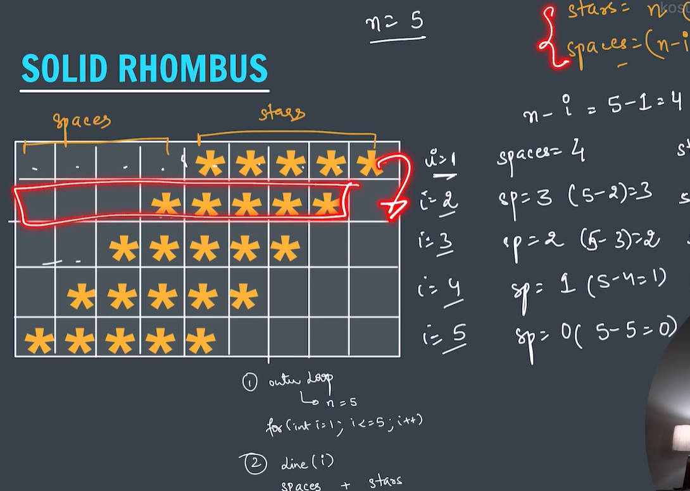

# Solid Rhombus Pattern

The Solid Rhombus Pattern is a shifted rectangle made completely of stars (`*`).

It is created using:

- Nested Loops
- Spaces
- Stars
- Pattern Shifting

This pattern helps in understanding:

- Space Management
- Nested Loop Logic
- Pattern Alignment
- Advanced Pattern Building

---

# Why Learn Solid Rhombus?

The Solid Rhombus Pattern teaches us how to shift a pattern towards the right using spaces.

It is an important pattern because:

- It introduces pattern shifting.
- It strengthens nested loop concepts.
- It acts as a foundation for Hollow Rhombus.
- It helps in understanding Diamond Pattern later.

---

# Pattern Output

For:

```java
solidRhombus(5);
```

Output:

```text
    *****
   *****
  *****
 *****
*****
```

---

# Visual Understanding

Add your screenshot here:

```md

```

The screenshot shows:

```text
Spaces + Stars
```

for every row.

Notice:

```text
Stars remain constant.
Spaces decrease every row.
```

---

# Program

```java
public class JavaBasics{

    public static void solidRhombus(int n){

        // Outer Loop
        for(int i=1;i<=n;i++){

            // Spaces
            for(int j=1;j<=n-i;j++){
                System.out.print(" ");
            }

            // Stars
            for(int j=1;j<=n;j++){
                System.out.print("*");
            }

            System.out.println();
        }
    }

    public static void main(String[] args) {
        solidRhombus(5);
    }
}
```

---

# Pattern Structure

Each row consists of:

```text
Spaces + Stars
```

Example:

```text
   *****
```

contains:

```text
3 Spaces
5 Stars
```

---

# Core Logic

The pattern follows two simple formulas.

### Spaces

```java
n - i
```

### Stars

```java
n
```

For:

```text
n = 5
```

Stars always remain:

```text
5
```

while spaces keep decreasing.

---

# Understanding the Screenshot

The screenshot explains:

```text
n = 5
```

For every row:

```text
Spaces = n - i

Stars = n
```

Let's calculate.

---

## Row 1

```text
i = 1
```

Spaces:

```text
5 - 1 = 4
```

Stars:

```text
5
```

Output:

```text
    *****
```

---

## Row 2

```text
i = 2
```

Spaces:

```text
5 - 2 = 3
```

Stars:

```text
5
```

Output:

```text
   *****
```

---

## Row 3

```text
i = 3
```

Spaces:

```text
5 - 3 = 2
```

Stars:

```text
5
```

Output:

```text
  *****
```

---

## Row 4

```text
i = 4
```

Spaces:

```text
5 - 4 = 1
```

Stars:

```text
5
```

Output:

```text
 *****
```

---

## Row 5

```text
i = 5
```

Spaces:

```text
5 - 5 = 0
```

Stars:

```text
5
```

Output:

```text
*****
```

---

# Complete Dry Run Table

| Row (i) | Spaces (n-i) | Stars (n) | Output |
|----------|-------------|------------|---------|
| 1 | 4 | 5 |     ***** |
| 2 | 3 | 5 |    ***** |
| 3 | 2 | 5 |   ***** |
| 4 | 1 | 5 |  ***** |
| 5 | 0 | 5 | ***** |

---

# Visual Grid Representation

| Row | Spaces | Stars |
|------|---------|---------|
| 1 | 4 | 5 |
| 2 | 3 | 5 |
| 3 | 2 | 5 |
| 4 | 1 | 5 |
| 5 | 0 | 5 |

Visual:

```text
Row 1 → ____*****
Row 2 → ___*****
Row 3 → __*****
Row 4 → _*****
Row 5 → *****
```

(_ represents spaces)

---

# Pattern Observation

### Spaces

```text
4
3
2
1
0
```

Spaces decrease by:

```text
-1
```

every row.

---

### Stars

```text
5
5
5
5
5
```

Stars remain constant.

---

# How the Rhombus is Formed?

First imagine a rectangle:

```text
*****
*****
*****
*****
*****
```

Now add spaces before each row:

```text
    *****
   *****
  *****
 *****
*****
```

The rectangle shifts towards the right.

This shifted rectangle becomes a Solid Rhombus.

---

# Loop Analysis

### Outer Loop

```java
for(int i=1;i<=n;i++)
```

Controls:

```text
Rows
```

Number of rows:

```text
n
```

---

### First Inner Loop

```java
for(int j=1;j<=n-i;j++)
```

Controls:

```text
Spaces
```

---

### Second Inner Loop

```java
for(int j=1;j<=n;j++)
```

Controls:

```text
Stars
```

---

# Time Complexity

### Outer Loop

Runs:

```text
n times
```

### Inner Loops

Run:

```text
n times
```

Overall:

```text
O(n²)
```

---

# Easy Memory Trick

Think:

```text
Rectangle
+
Left Spaces
=
Solid Rhombus
```

or

```text
Spaces ↓
Stars Fixed
```

Remember:

```java
Spaces = n - i

Stars = n
```

and the entire pattern is done.

---

# Key Learning

- Solid Rhombus is a shifted rectangle.
- Spaces create the slant effect.
- Stars remain constant.
- Spaces decrease every row.
- Nested loops work together to create patterns.
- This pattern forms the base for Hollow Rhombus and Diamond Pattern.

---

# Special Note

Whenever you see:

```text
Rhombus Pattern
```

first think:

```text
Spaces + Rectangle
```

For Solid Rhombus:

```java
Spaces = n - i
Stars = n
```

This single logic creates the complete pattern.
